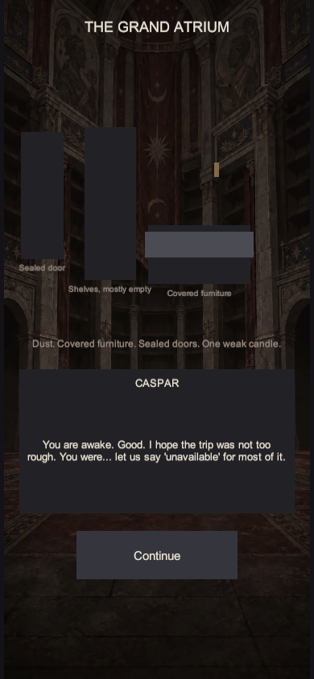
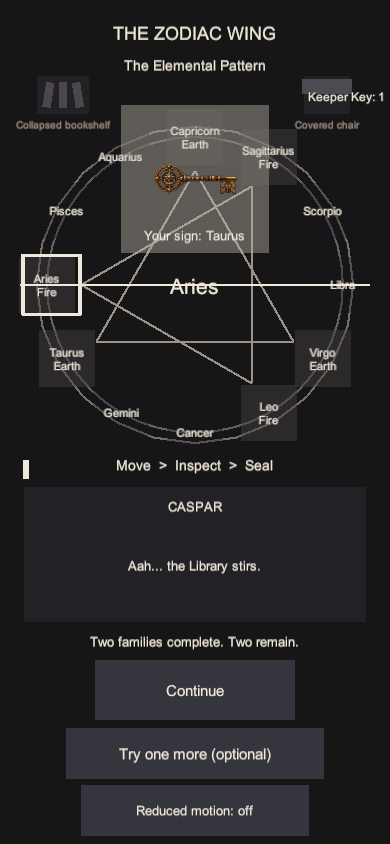
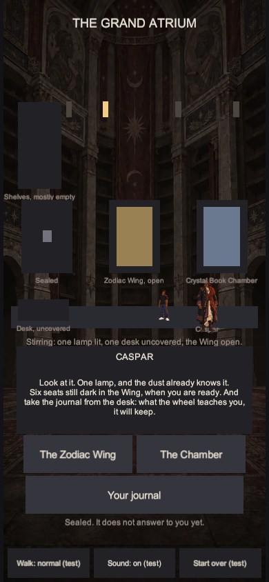

# Dormant rooms and Batch 2 art review

This pass follows the approved Ascendant ClickUp art direction and the slot dimensions in [`ART-SLOTS.md`](ART-SLOTS.md). The three room images are dormant Stage 1 architecture; lighting overlays remain outside the manifest until their build adds those slots. Batch 2 adds Caspar, the Keeper's idle and walk frames, and the Keeper Key as transparent cutouts.

## Prompt set

The built-in image generation tool used the canonical Ascendant cinematic illustration reference for controlled dark linework, cel-shaped shadow planes, aged materials, and the Library palette. Caspar used the locked master image plus the turnaround, expressions/hair, and costume/artifact sheets as identity references. The Keeper idle used the approved Keeper preview as its identity reference; the walk frame used the idle image. The Key used the Celestial Dial preview as its metalwork reference.

| Slot | Final prompt direction | Installed pixels |
| --- | --- | --- |
| `caspar` | Full-body near-front resting Caspar matching the locked mature Ethiopian/Kushite design, gray-streaked low ponytail and beard, near-black navy reinforced coat, layered indigo/burgundy/cream/burnt-sienna clothing, woven geometry, brass medallion and ring, leather-capped travel vessel, dark boots. | 88 × 152 |
| `keeper-idle` | Young African American man with short tight curly afro, plain black T-shirt, baggy dark-blue jeans with faint orange detail and bright white low-top Air Force 1 shoes; neutral alert pose. | 40 × 88 |
| `keeper-walk` | The same Keeper with the same face and clothing, in a modest mid-step pose with both white shoes visible. | 40 × 88 |
| `keeper-key` | One horizontal aged brass and dark-iron mechanical key, bow left and bit right, celestial geometry, restrained crimson enamel, a scorpion integrated into the bow. | 168 × 80 |

Each prompt required one complete cutout on genuine transparent alpha, clear at half the installed pixel dimensions in the game, with no backdrop, floor shadow, glow, extra object, text, photorealism, 3D, or generic anime rendering. The four generated originals are preserved in the local Codex generated-images folder; the installed PNGs are the slot-sized finals.

## Integration and validation

- The opening Atrium's sealed-door placeholder was moved from the right to the left. Shelves, covered furniture, dust cloth and candle were shifted clear of it. The later Atrium already had the sealed door on the left.
- Unity 6000.3.24f1 imported the seven PNGs as compressed UI sprites with the slot caps and transparency preserved. `?style` reported 7 of 30 art slots as files.
- The shared `Ascendant.Build.WebBuild.Build` completed with zero errors and zero warnings. Its local output was checked at a 390 × 844 browser viewport. The scripted Unity walkthrough captured the opening, Key reveal, and Atrium hub at the same size; it was stopped after those requested views, so it is not a full-suite pass.
- The opening screenshot shows the left sealed door clear of the other placeholders. The hub shows Caspar and the Keeper at their live sizes; the Keeper's white shoes and Caspar's layered silhouette remain visible. The Key reads horizontally in the Dial reveal.

### Phone captures

