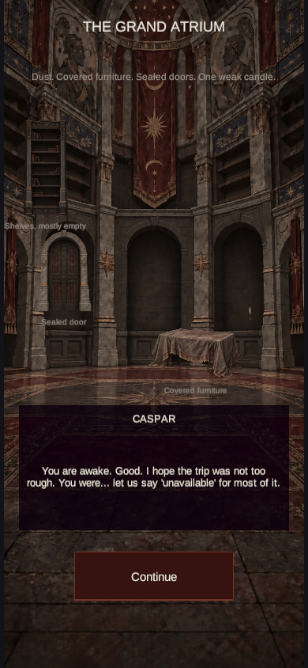
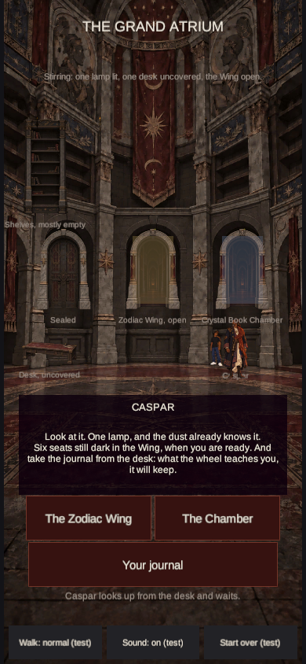
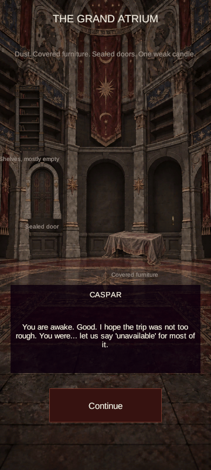
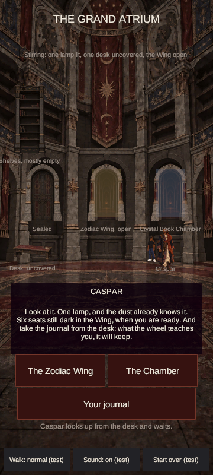
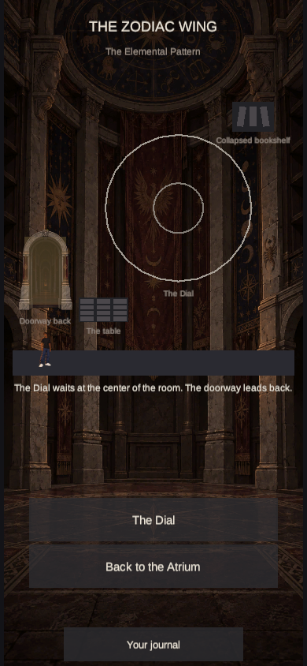

# Atrium scene pass — 18 September 2026

This pass composes the opening and Stage 2 Atrium around the fixed 360 × 800 game layout. The approved dormant Stage 1 lighting and the separate interactive art slots remain in use. The three future transparent room-light overlays are not installed because they are outside the current manifest.

## Art and layout

- Replaced `atrium.png` with a dormant room image whose three dark ground-floor bays line up with the game doors. The left bay holds the sealed door. The upper left wall has room for the mostly empty shelves; the foreground has floor space for the covered furniture, uncovered desk, Caspar, and the Keeper. The background contains architecture, distant wall portraits, and motifs, without painting the interactive objects into it.
- Added seven transparent cutouts: `door-sealed`, `door-open`, `shelves`, `furniture-covered`, `desk`, `lamp`, and `candle`. The two doors share the Atrium's stone arch treatment. `door-open`, `lamp`, and `candle` are reused by other rooms.
- Aligned the opening sealed door and shelves to their hub sizes and positions. Placed the covered furniture on the foreground floor. Shifted the opening description above the props to keep it clear of their labels.
- Removed the Atrium's opaque walking strip so the Keeper and Caspar stand on the illustrated floor. Reduced the flat doorway tint when a door image is installed; placeholder doors keep their original tint. The Wing's reused open doorway gets the same treatment. Atrium dialogue panels and buttons use dark crimson/near-black tones from the approved Library palette.
- Existing prop labels remain. The owner has not decided whether to remove them after art replacement.

## Image generation prompt set

All eight final images were created or revised with the built-in ImageGen tool. The room and prop prompts used the previous Atrium image as an architectural source. The canonical cinematic illustration image was used as a style reference for the room. The prompts required polished 2D animation illustration, controlled dark linework, cel-shaped shadows, tactile aged materials, dusty muted Stage 1 values, and no golden-hour light in the room background. The seven cutout prompts required genuine transparent alpha and no surrounding room.

| File | Final prompt direction | Installed pixels |
| --- | --- | --- |
| `atrium.png` | Preserve grand two-story stone architecture, faded crimson carpet, upper portraits of Black scholars and rulers, and subtle celestial, scorpion, and phoenix motifs. Provide three empty dark arched bays behind separate left, center, and right door sprites; clear upper-left shelf and foreground furniture zones. Shorten the banner above the bays. Keep the room dormant and dusty. | 720 × 1600 |
| `door-sealed.png` | Heavy dark-wood and iron Library door within the matching narrow weathered stone arch; faded crimson inlay, visible lock, small phoenix in metalwork. Straight-on, muted, no glow. | 140 × 200 |
| `door-open.png` | Same stone arch proportions, with a receding dark passage, faded crimson side banners, small carved face at keystone, restrained distant warmth. Reusable for Wing and Chamber entrances. | 140 × 200 |
| `shelves.png` | Tall near-black wood shelves, mostly empty, scattered aged books and a few faded crimson spines, dust, small carved scorpion in crown. | 120 × 360 |
| `furniture-covered.png` | Low writing desk beneath a rumpled centuries-old dust cloth with muted crimson undertone, three-quarter front view and attached contact shadow. | 240 × 140 |
| `desk.png` | Same desk uncovered: worn dark wood, cracked faded crimson leather writing surface, tiny inkwell and tool marks, attached contact shadow. | 140 × 60 |
| `lamp.png` | Narrow wall-mounted aged iron/brass oil sconce, tiny readable silhouette, one restrained flame; state brightness remains controlled by the game. | 16 × 44 |
| `candle.png` | One pale wax candle with drips, weak flame, aged brass holder, narrow readable silhouette. | 16 × 40 |

## Validation

- Unity 6000.3.24f1 imported the assets and completed the shared `Ascendant.Build.WebBuild.Build` with **zero errors and zero warnings**. The output was 17,612,956 bytes.
- All seven cutouts have transparent corners, and every file matches its slot's 2× dimensions. The style page reports **14 of 30** art slots filled.
- A focused browser walkthrough passed at **390 × 844** and **360 × 800**. It reached the opening and the Stage 2 hub, exercised the sealed door and Keeper walk to Caspar, and checked no vertical scroll. The reused open doorway was also visually checked in the Wing at 390 × 844.
- This is a local draft; production Pages deployment has not been run.

### Phone captures

