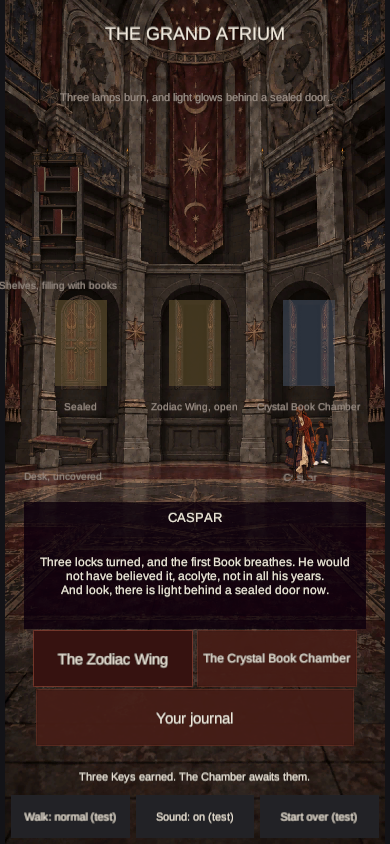
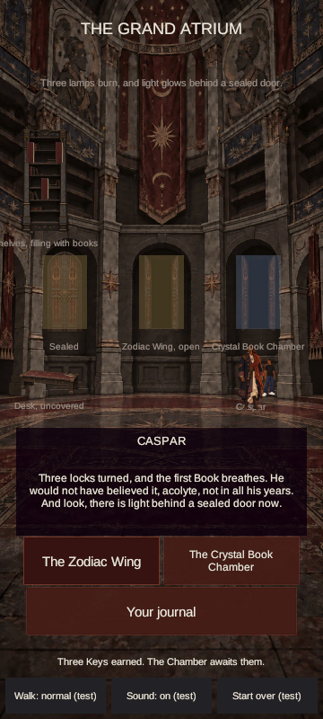
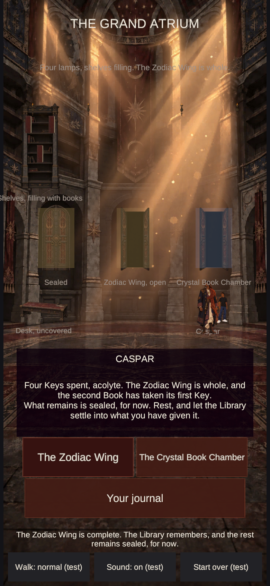
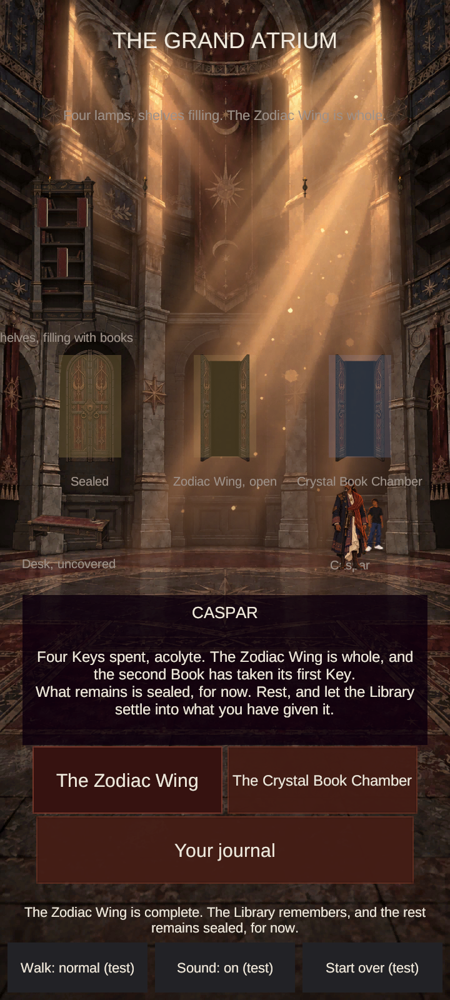

# Room light overlays — art batch — 19 September 2026

## Direction

Followed the approved ClickUp Visual Language (`2kyd583p-24354`), art direction and lighting decision (`2kyd583p-24954`), and Decisions Log (`2kyd583p-24214`). The dormant room backgrounds remain unchanged. This batch fills the three Build H lighting slots with separate transparent art: no golden-hour illumination is baked into `atrium.png`, `wing.png`, or `chamber.png`. Stage 1 remains dark; the shipped stage fade remains the only control over when the light appears.

## Artwork

| Slot | Final size | Final file | Notes |
| --- | ---: | --- | --- |
| `atrium-light` | 720 × 1600 | `Assets/CelestialDial/Resources/Art/atrium-light.png` | Amber shafts from the upper architecture, sparse lit dust, restrained bounce on stone and floor. |
| `wing-light` | 720 × 1600 | `Assets/CelestialDial/Resources/Art/wing-light.png` | Same amber/copper treatment; floor reflections stay subordinate to the Dial space. |
| `chamber-light` | 720 × 1600 | `Assets/CelestialDial/Resources/Art/chamber-light.png` | Same treatment, with broad shadows preserved around the central play area. |

Generated with the built-in ImageGen tool using each room background for composition/alignment and the canonical Ascendant style reference. Each output was inspected over its room before Unity integration. The generated source images remain in the local Codex generated-images folder; the normalized project PNGs above are the selected finals.

### Final prompt set

These are the three prompt bodies sent to the built-in generator, with the approved Atrium/Wing/Chamber background as image 1 and the canonical style reference as image 2.

**Atrium**

> Use case: illustration-story. Asset type: a NEW transparent game lighting overlay, exact registered to the existing Ascendant Atrium background. Input image 1 is the Atrium background and is a composition/alignment reference only; do not repaint, reproduce, or include its architecture, portraits, doors, carpet, text, furniture, or props. Input image 2 is the controlling Ascendant Cinematic 2D Illustration style reference. Create a 720 x 1600 portrait RGBA PNG. Primary request: depict only the later-stage golden-hour transformation specified for this room as a sparse transparent layer: motivated amber shafts of light entering through existing high architectural openings, restrained warm light on the existing upper masonry, a small number of visible dust motes only within the shafts, subtle warm bounce on a few existing stone edges. Keep broad areas completely transparent and keep the lower foreground largely clear so characters, props, dialogue, and controls remain readable. Match the image 1 crop exactly; light must align with openings and architecture already present. Preserve Stage 1 as untouched by keeping light transparent everywhere except localized later-stage illumination. Style: controlled 2D animated-film linework and cel-shaped painterly light planes, dusty muted amber and copper, restrained rather than bright. Constraints: genuine alpha transparency outside the light; no opaque backdrop or colored canvas; no new architecture or windows; no golden-hour background repaint; no object silhouettes; no UI; no lettering; no glow around characters; no broad full-frame amber tint; no watermark. Keep the mood ancient, scholarly, grounded, and cinematic.

**Wing**

> Use case: illustration-story. Asset type: a NEW transparent game lighting overlay, pixel-aligned to the Zodiac Wing room background in input image 1. Input 1 is only for composition and alignment: do not repaint or include its architecture, zodiac dial, shelves, table, chair, books, text, or props. Input 2 controls the Ascendant Cinematic 2D Illustration rendering style. Create a portrait RGBA lighting layer at the same 720 x 1600 composition as input 1. Depict only the later-stage golden-hour transformation: narrow motivated amber shafts from existing upper architectural openings, restrained warm light on existing stone edges and parts of the room, and a few dust motes only inside the beams. Respect the room's existing geometry and leave the Dial face and foreground gameplay area mostly clear. Keep broad regions fully transparent; the layer is invisible at Stage 1 and reaches full strength only at the later stages. Controlled 2D illustrated cel-shaped light planes, painterly texture selectively, dusty amber/copper, deep shadows preserved. Require genuine alpha outside localized light. No backdrop, no full-frame tint, no new windows or architecture, no new objects, no lettering, no icons, no watermarks, no glow effects.

**Chamber**

> Use case: illustration-story. Asset type: a NEW transparent game lighting overlay, pixel-aligned to the Crystal Book Chamber background in input image 1. Input 1 is only the exact composition and alignment reference. Do not repaint or include its architecture, mechanism, Books, candles, door, shelves, text, or props. Input 2 controls the Ascendant Cinematic 2D Illustration style. Create a portrait RGBA layer matching the 720 x 1600 background composition. Show only the later-stage golden-hour transformation described by the approved art direction: motivated amber light entering through existing high openings, narrow visible shafts, selective warm light along existing stone and floor planes, a few fine dust motes in the rays. Preserve the room's current geometry and keep the central gameplay and Book areas mostly readable; broad shadows remain dark. Areas outside the light are genuinely transparent so this layer is invisible at Stage 1 and fades in only at later stages. Crisp illustrated cel-shaped light with painterly detail selectively, dusty amber and copper, restrained, ancient scholarly cinematic mood. No opaque canvas, no global amber wash, no new architecture or windows, no object silhouettes, no lettering, no icons, no watermarks.

## Phone review

The integrated WebGL player was inspected at **390 × 844** and **360 × 800**. At Stage 1, the overlays remain invisible and the Atrium keeps its muted, shadow-led look. At Stage 6, the Atrium reaches full strength with the same direction and color language. The Wing and Chamber artwork was also checked as a room-plus-overlay composite at phone scale before import; the full browser walkthrough exercised both rooms at both viewport sizes.

The before captures below are the Stage 4 Atrium return from the merged Wing scene pass, before room-light artwork was installed. The after captures show the full Stage 6 Atrium light. They are deliberately labeled by progression state rather than presented as the same game state.

### Before — Stage 4, no production overlay art

### After — Stage 6, full Atrium overlay

The Stage 1 opening and early room captures are retained alongside these in [`Evidence/room-light-overlays-2026-09-19`](Evidence/room-light-overlays-2026-09-19).

## Validation

- Unity `6000.3.24f1` performed a clean Library import, imported the three transparent PNGs as compressed sprites, and ran the shared `Ascendant.Build.WebBuild.Build` entry point.
- Build result: succeeded; **0 errors, 0 Unity build warnings**; 64,850,567 bytes. The loader, framework, WebAssembly, data, and `index.html` outputs were present.
- The full browser suite passed **268 checks** at 390 × 844 and 360 × 800, device scale 2 with touch emulation. It confirmed no runtime exceptions or vertical scroll, Stage 1 darkness, the Stage 2 quarter fade, full Stage 6 fade, all 33 art-slot sources, and both style pages.
- The build was served on localhost only. Production was not changed.

## Remaining art slots

Eleven of the 33 image slots remain empty: `seat`, `bracket`, `floor-markings`, `book-cover`, `book-page`, `journal-page`, `journal-cover`, `mechanism`, `crystal-book`, `crystal-page`, and `lock`.

See also: [the Wing scene pass](WING-SCENE-PASS-2026-09-19.md) and [the Atrium cohesion assessment](ATRIUM-COHESION-2026-09-19.md).
